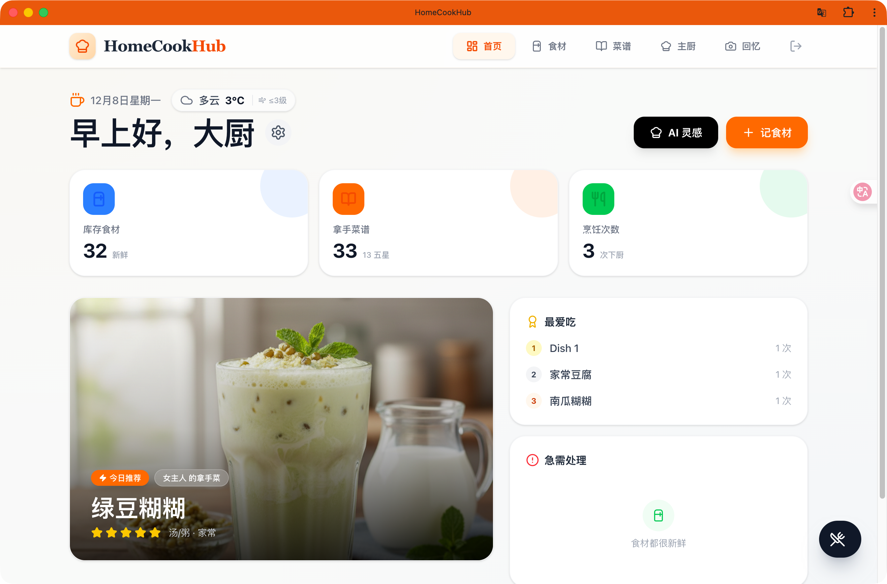
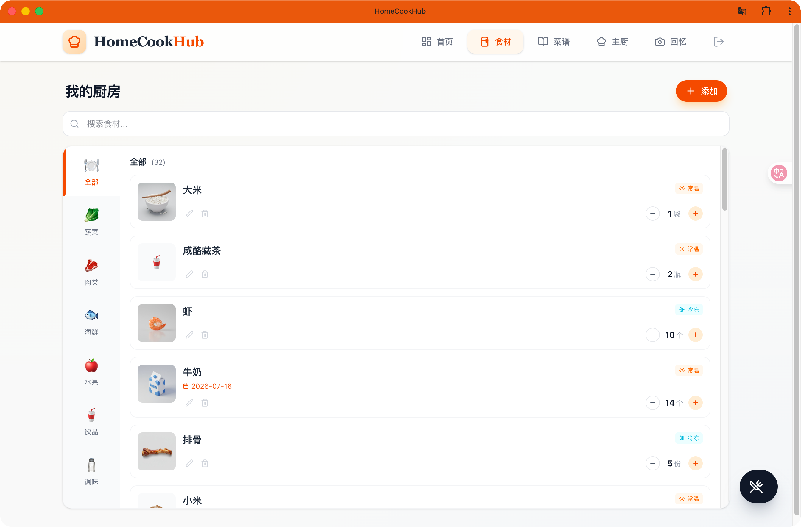
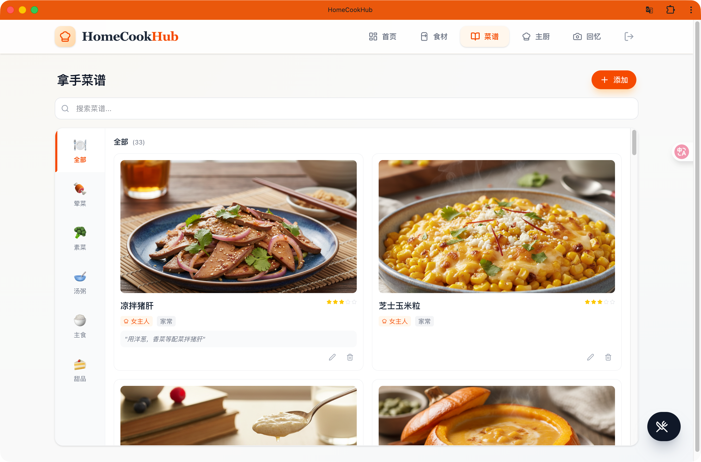
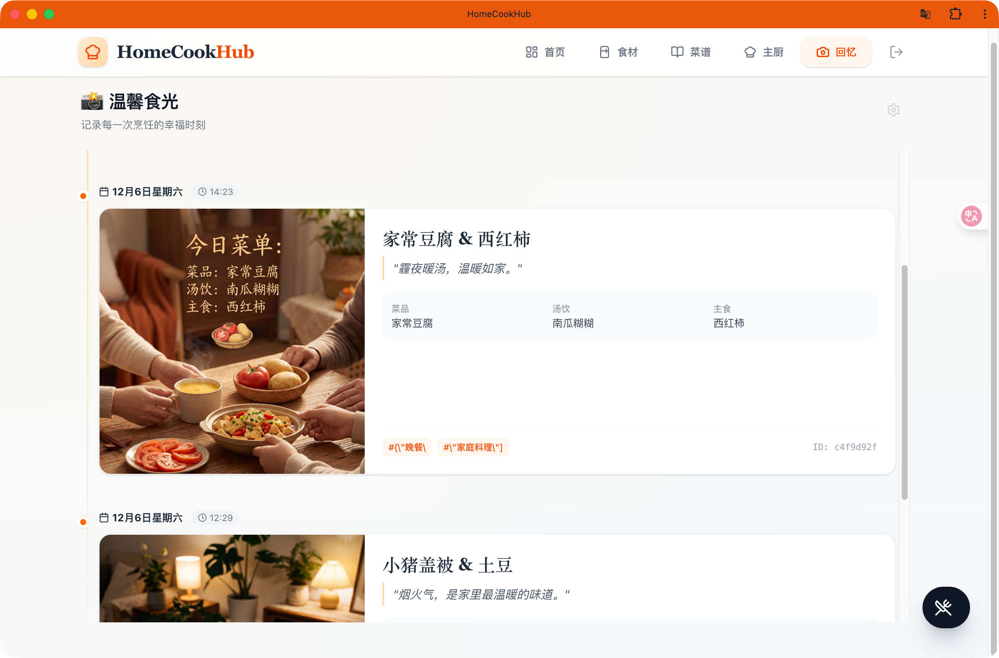
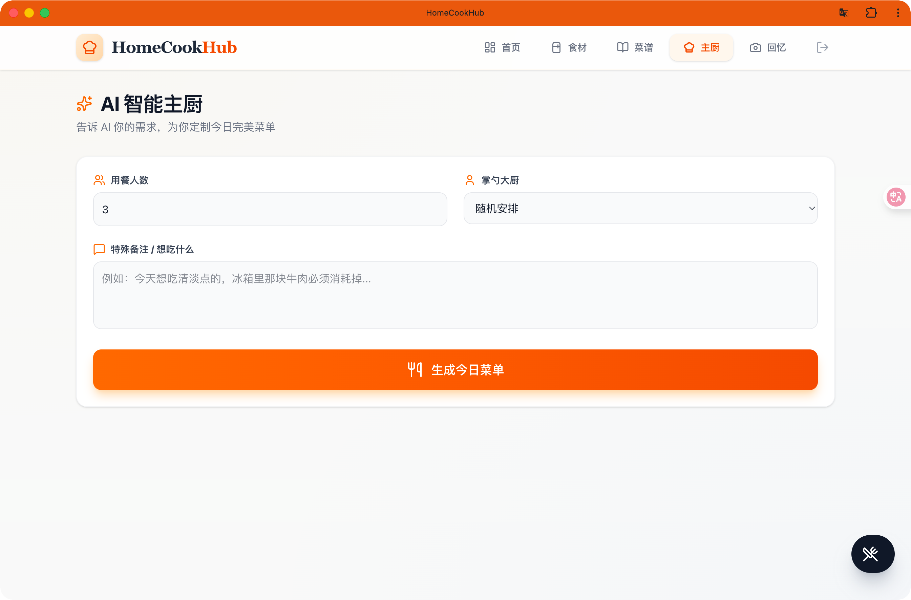

# HomeCookHub (家庭点餐系统)

HomeCookHub 是一个集食材管理、菜谱记录与 AI 智能推荐于一体的现代化家庭厨房助手。它解决“今天吃什么”“冰箱里还有什么”“怎么做”的日常难题，通过数字化管理提升烹饪乐趣与效率。

## ✨ 核心功能

- 食材库存管理：录入名称、数量、单位、分类、存放位置，支持临期提醒与快速消耗
- 家庭菜谱库：记录拿手菜，支持上传或本地化图片，打分与标签管理
- AI 智能主厨：基于库存与历史偏好推荐菜单，支持自定义 OpenAI 兼容接口
- 数据看板：展示库存预警、烹饪统计与“最爱吃”排行

## 🖼️ 系统截图

> 以下为实际页面截图，展示核心功能与交互效果。







## 🛠️ 技术栈

- 前端：React + Vite，Tailwind CSS + Lucide React，React Router
- 后端：FastAPI (Python 3.10) + SQLite 持久化
- 反向代理：Nginx（前端静态托管 + 后端 API 代理）
- 部署编排：Docker Compose（见 `DEPLOY.md`）
- AI 集成：OpenAI 兼容接口（API URL & Key 可配置）

## 🚀 快速开始

### 开发环境
- 前置要求：Node.js (v18+)
- 安装依赖：`npm install`
- 配置环境变量（可选，用于天气展示）：在项目根目录新建 `.env`
```
VITE_WEATHER_KEY=你的_高德天气_API_KEY
```
- 启动开发：`npm run dev`

### 生产部署
- 使用 Docker Compose 一键部署前后端，持久化数据库与图片
- 详见 `DEPLOY.md`

## 📂 项目结构
```
backend/           # FastAPI 后端（SQLite、认证、业务接口、静态文件）
src/               # 前端 React 应用
├── components/    # 通用组件
├── context/       # 全局状态 (AppContext)
├── hooks/         # 自定义 Hooks
├── pages/         # 页面（仪表盘、库存、菜谱、AI 主厨、记忆等）
├── assets/        # 项目截图与静态资源
Dockerfile         # 前端构建与 Nginx 部署
backend/Dockerfile # 后端镜像构建
docker-compose.yml # 本地/构建部署
docker-compose.prod.yml # 生产镜像部署
nginx.conf         # 前端 Nginx 代理配置
DEPLOY.md          # 生产部署说明
```

## 🌟 项目亮点

- 家庭私用、轻量易上手，完整闭环：库存 → 菜谱 → 做饭 → 记忆
- 图片本地化与静态托管，稳定可靠，无外部存储依赖
- AI 助力菜单灵感，支持自定义兼容接口，灵活可控
- 一键 Docker Compose 部署，前后端同盘持久化，维护成本低

## 📄 许可证

MIT License
